<h1 align="center">基于SpringBoot的幼儿园管理系统【带论文】</h1>

- <b>完整代码获取地址：从戎源码网 ([https://armycodes.com/](https://armycodes.com/))</b>
- <b>技术探讨、资料分享，请加QQ群：692619798</b>
- <b>作者微信：19941326836  QQ：3645296857</b>
- <b>承接计算机毕业设计、Java毕业设计、Python毕业设计、深度学习、机器学习</b>
- <b>选题+开题报告+任务书+程序定制+安装调试+论文+答辩ppt 一条龙服务</b>
- <b>所有选题地址 ([https://github.com/Descartes007/allProject](https://github.com/Descartes007/allProject)) </b>

## 一、项目介绍

基于SpringBoot的幼儿园管理系统，系统角色主要有：管理员（后台）、教师、用户。主要功能：
### 管理员（后台）：
- 基本：登录、修改密码、获取/修改个人信息、登出
- 系统配置：查看/新增/修改/删除系统配置
- 用户管理：查看/筛选/新增/修改/删除用户、重置密码、查看会话
- 教师管理：教师信息 CRUD、登录管理
- 幼儿管理：幼儿信息列表/详情/新增/修改/删除、按教师/家长过滤
- 考勤/请假/体检：请假记录、体检记录 CRUD 与筛选
- 工作日志与考核：发布/查看工作日志、职工考核记录管理
- 资源与订单：资源信息管理、后台订单/统计查看
### 教师：
- 基本：登录、修改密码、获取/修改个人信息、会话
- 幼儿相关：查看自己班级/负责幼儿信息、提交/审批请假、查看体检、工作日志记录
- 交互：按工号筛选数据，能使用提醒统计接口获取到期/提醒项
### 用户：
- 基本：注册、登录、修改密码、会话信息
- 幼儿信息：查看自家幼儿信息、提交请假申请、查看体检/请假记录
- 权限：按用户名/角色隔离数据（只能看到与自身关联的数据）

## 二、项目技术

- 编程语言：Java（后端））
- 架构：B/S（前后端分离）

## 三、运行环境

- JDK版本：1.8及以上都可以
- 操作系统：Windows7/10、MacOS
- 开发工具：IDEA、Ecplise、MyEclipse都可以

## 四、数据库配置文件

- npm版本：6.14.13及以上都可以
- Redis版本：3.2.100及以上都可以
- 文件名：application.yml
- 编码类型：utf8

## 论文截图

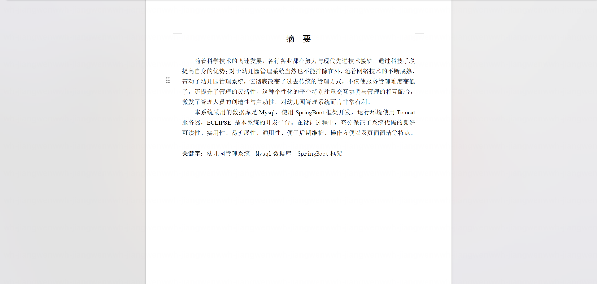

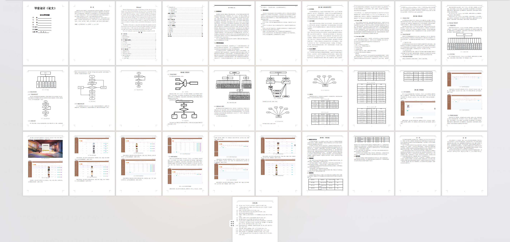

## 系统截图

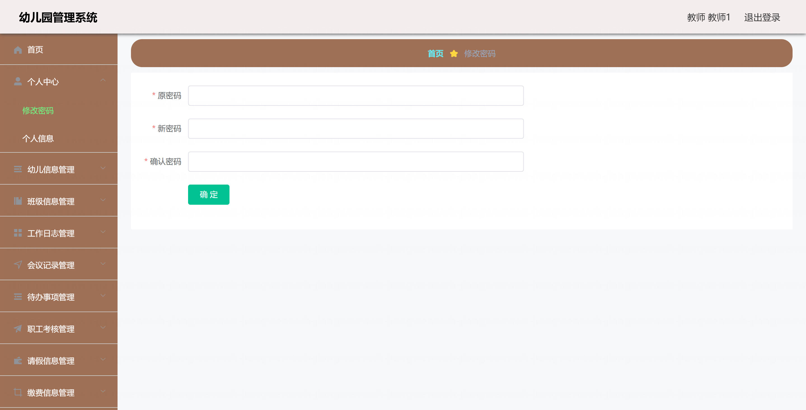

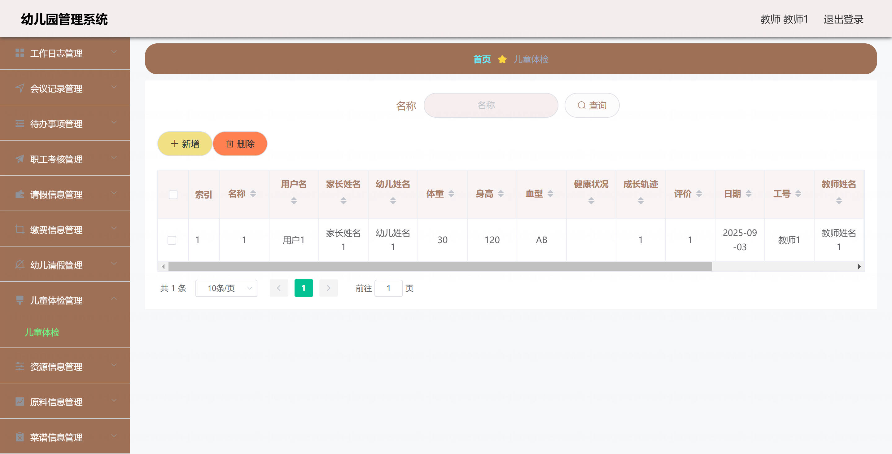

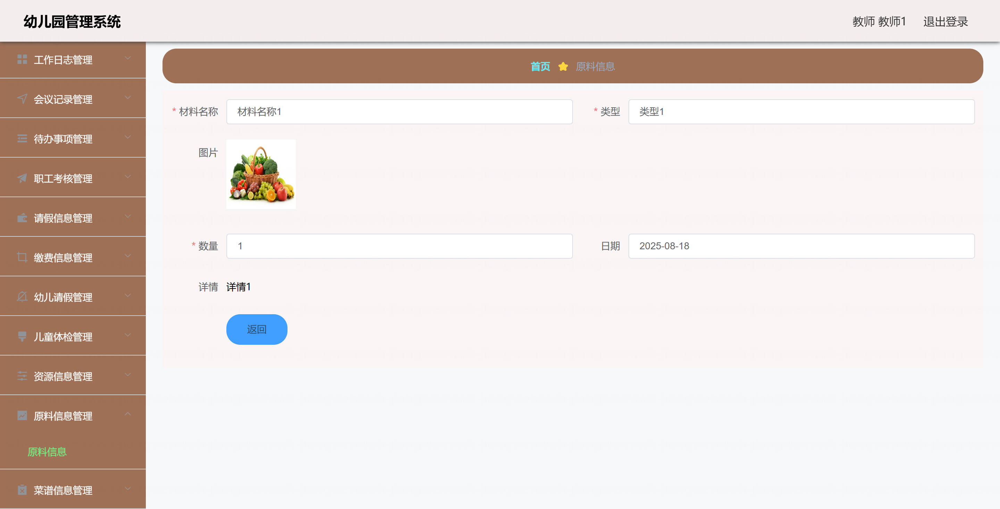

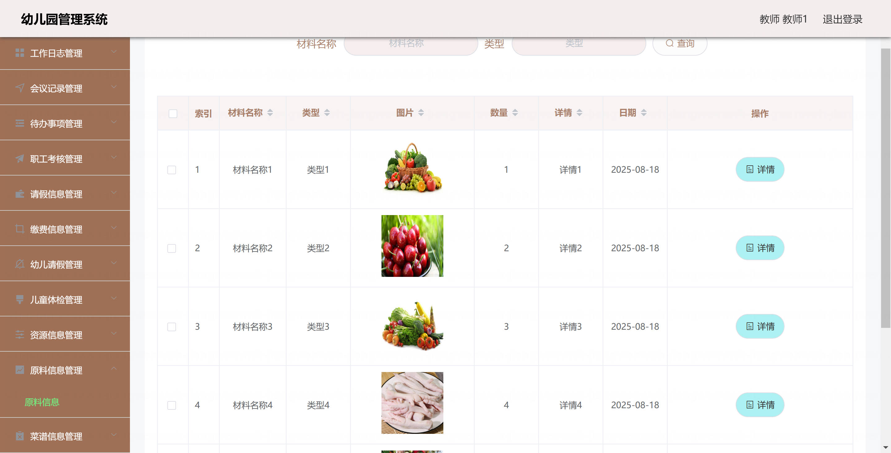

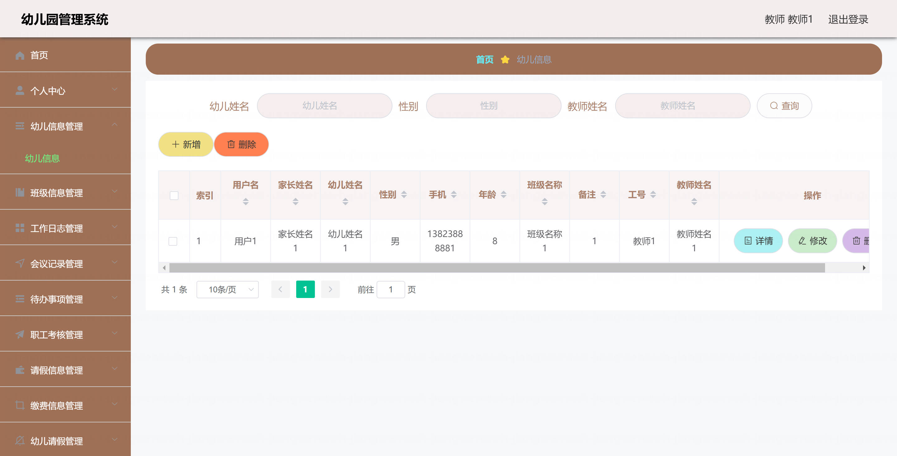

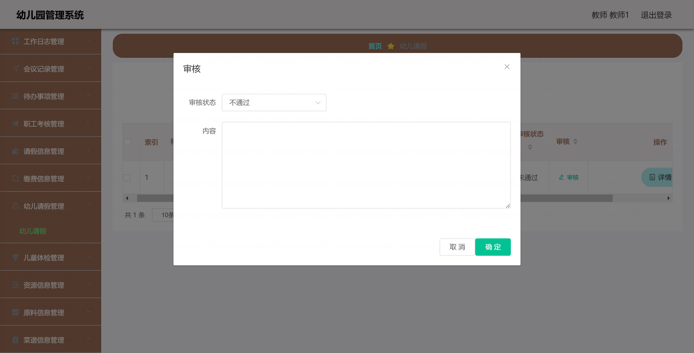

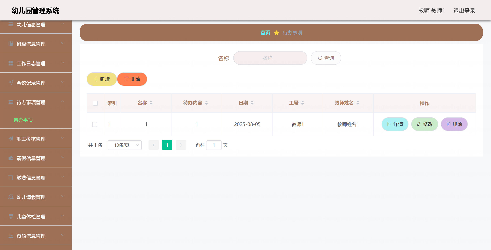

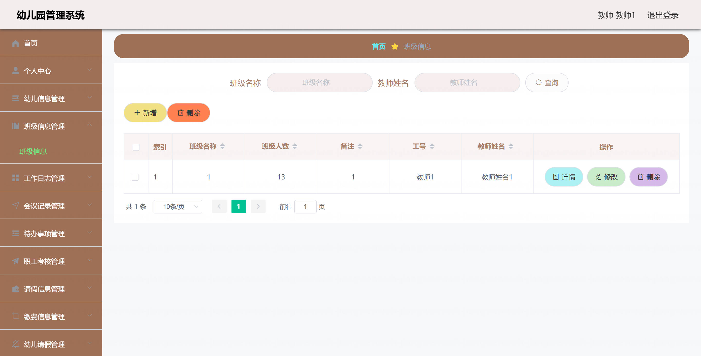

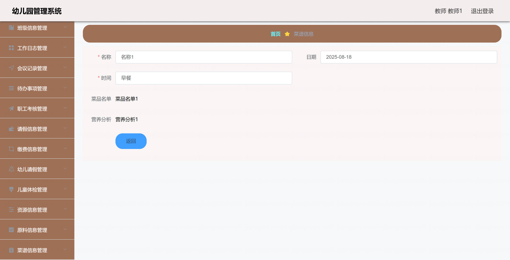

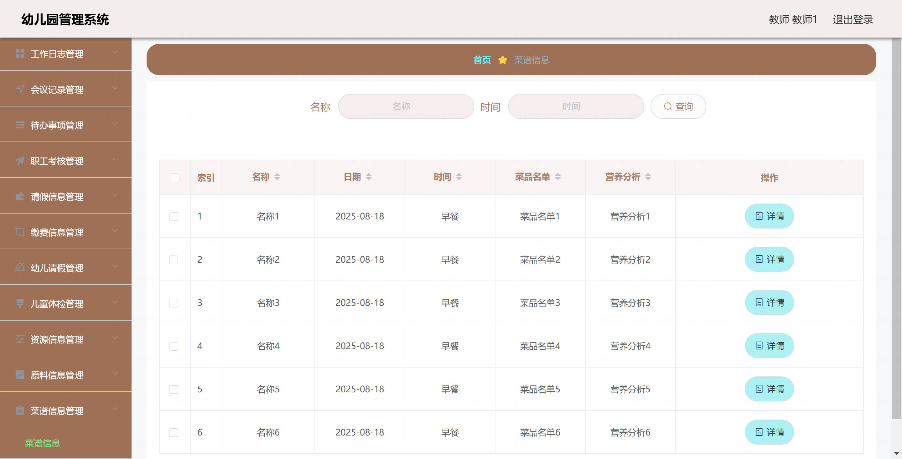
